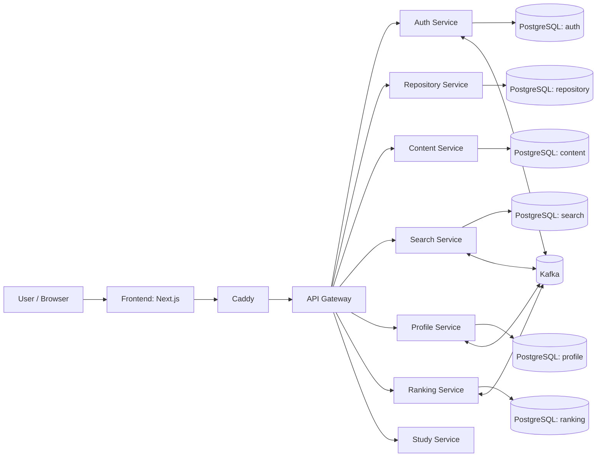

# Forklore

**Forklore** — knowledge-platform с git-like механиками для учебных материалов: конспектов, статей, шпаргалок, методичек и заметок.

Победитель хакатона **«{Идея.Код.Релиз} 2026»**.

---

## Кратко о проекте

Forklore переносит подход GitHub в образовательный контекст: знания оформляются как репозитории, у материалов есть история изменений, форки и возможность отката версий.

Платформа строится как инженерный продукт с микросервисной архитектурой, разделением доменов и event-driven интеграциями.

---

## Почему это важно

Большинство учебных материалов живут в разрозненных файлах и чатах, без нормальной истории изменений и удобного переиспользования.  
Forklore делает знания версионируемыми и эволюционирующими артефактами: их можно улучшать, форкать и адаптировать под свои задачи.

---

## Проблема

- Материалы быстро устаревают и теряют контекст правок.
- Нет прозрачной модели совместной доработки учебного контента.
- Сложно безопасно переиспользовать чужие публичные наработки.
- Отсутствует единая среда для хранения, редактирования и развития знаний.

## Решение

Forklore предоставляет платформу, где пользователи могут:

- создавать публичные и приватные репозитории знаний;
- загружать файлы и создавать документы в онлайн-редакторе;
- хранить историю изменений и откатываться к прошлым версиям;
- делать fork чужих публичных материалов;
- подписываться на авторов и отслеживать активность.

---

## Core features

- Репозитории знаний (public/private)
- Версионирование и история изменений
- Откат к предыдущим версиям
- Fork публичных материалов
- Онлайн-редактор документов
- Загрузка и хранение файлов
- Подписки на авторов
- Профильная активность и статистика

---

## Engineering focus

- Микросервисная декомпозиция по бизнес-доменам
- Синхронное API-взаимодействие через gateway
- Асинхронные события через Kafka
- Изолированные PostgreSQL-инстансы для сервисов
- Локальный инфраструктурный запуск через Docker Compose

---

## Обзор архитектуры



---

## Сервисы и зоны ответственности

- **api-gateway** — единая точка входа и маршрутизация запросов.
- **auth-service** — аутентификация, JWT, управление токенами.
- **repository-service** — репозитории знаний, доступы, fork-операции.
- **content-service** — документы, файлы, версии и откаты.
- **search-service** — индексация и поиск материалов.
- **profile-service** — профили, подписки, пользовательская активность.
- **ranking-service** — ранжирование и сигналы релевантности.
- **study-service** — учебные сценарии и связанная доменная логика.

---

## Технологический стек

### Backend
- Go
- gRPC / HTTP
- PostgreSQL
- Kafka

### Frontend
- Next.js
- React
- TypeScript

### Infrastructure
- Docker Compose
- Caddy

---

## Личный вклад

- Полная backend-часть на Go
- Значительная часть frontend (Next.js/React/TypeScript)
- Дизайн интерфейса не входил в мой scope
- LLM/Python-часть не входила в мой scope

---

## Локальный запуск

### Требования

- Docker + Docker Compose
- Git

### 1) Клонирование

```bash
git clone https://github.com/Anabol1ks/Forklore.git
cd Forklore
```

### 2) Настройка окружения

Создайте `.env` с нужными переменными сервисов и инфраструктуры.

> Важно: не публикуйте реальные секреты (API keys, JWT secrets, IAM tokens) в репозитории.

### 3) Запуск через Docker Compose

```bash
docker compose up --build
```

Фоновый режим:

```bash
docker compose up -d --build
```

Остановка:

```bash
docker compose down
```

---

## Environment / Config

Рекомендуется использовать `.env.example` (если добавлен) либо локальный `.env`.

Блоки переменных:

- `DB_*` — подключения к PostgreSQL для сервисов
- `*_PORT`, `*_SERVICE_ADDR` — адреса и порты сервисов
- `KAFKA_*` — брокер и топики событий
- `JWT*`, `*TokenTTL*` — аутентификация и TTL токенов
- `LLM_*`, `YANDEX_*` — интеграции LLM (опционально)
- `CADDY_DOMAIN` — домен reverse-proxy

---

## Roadmap

- [ ] Улучшить observability (логи, метрики, трассировка)
- [ ] Расширить integration/e2e покрытие межсервисных сценариев
- [ ] Усилить релевантность поиска и ranking pipeline
- [ ] Улучшить DX: единые команды bootstrap/test/lint
- [ ] Доработать модель доступа для командной работы над материалами

---

## Live demo

Проект демонстрировался на хакатоне.  
Если публичный стенд недоступен, используйте локальный запуск через Docker Compose.

---

## Структура репозитория

```text
Forklore/
├── api-gateway/
├── auth-service/
├── repository-service/
├── content-service/
├── search-service/
├── profile-service/
├── ranking-service/
├── study-service/
├── frontend/
├── app/
├── pkg/
├── tutor_search/
├── txt_extractor/
├── docker-compose.yml
├── Caddyfile
└── README.md
```

---

## License

Проект распространяется по лицензии, указанной в файле [LICENSE](./LICENSE).

